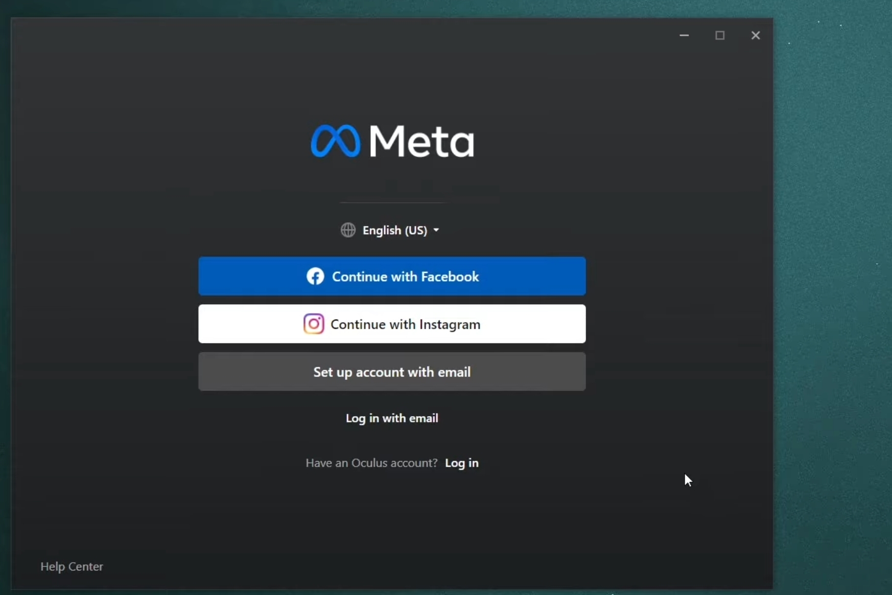
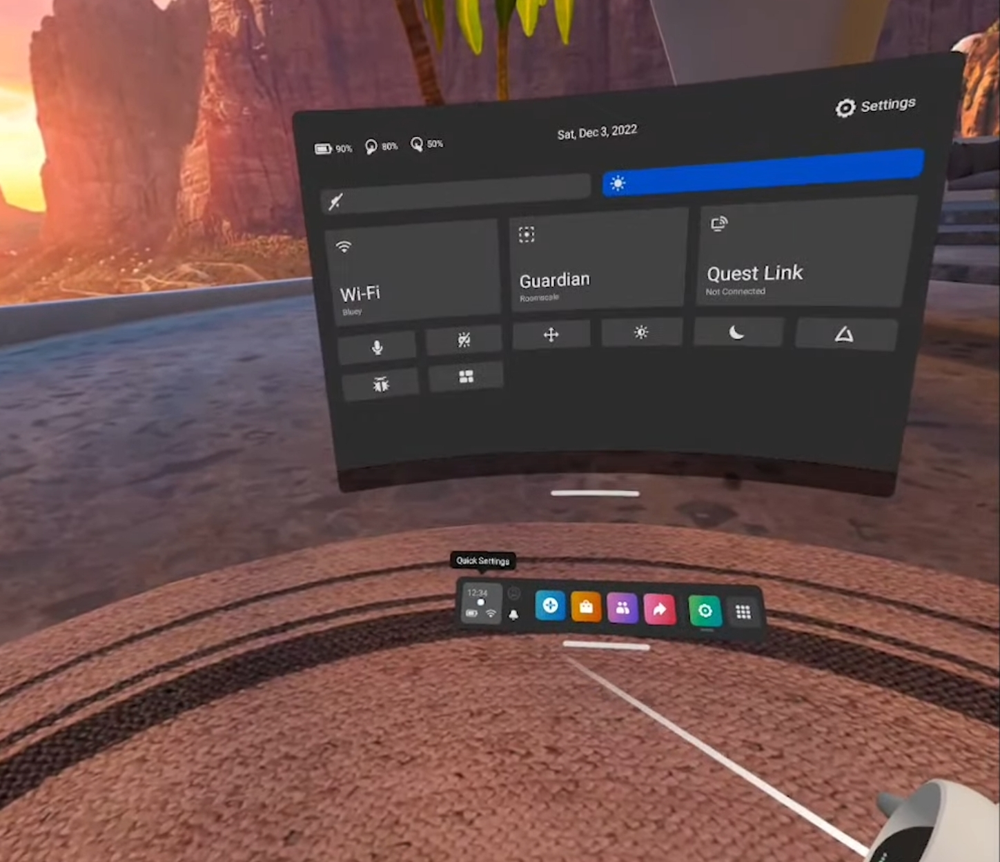

## Set up Meta Quest 2
- downlaod windows software from https://www.meta.com/de/en/quest/setup/

- go through the setup process with the default settings

- sign in with either facebook, instagram or your meta account (suggested, if you try to do something that is meta does not want, because then not your whole meta, facebook and instagram gets deleted automatically)

- Choose your headset (you can choose form Meta quest pro, quest 2, quest, rift s, rift)

you can choose between two connection methods: link(cable) and air link(wireless). We will choose the wireless method as it is much more comfortable and works rather good, but if you have any latency problems or conectivity issues you can always choose the wired method. 

## Set up AIR link 
- go into your quest
- click into the quick settings on the bottom right and then click on quest link

- you should see your pc and choose it

- confirm the pairing code on the pc

And you are all paired up!

