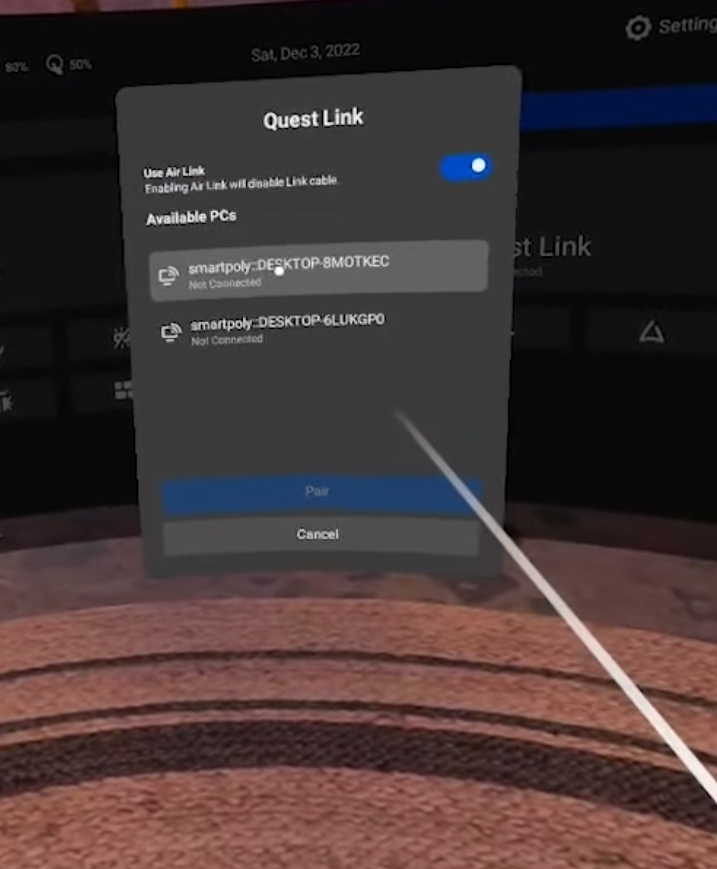

In 2023 there are many headsets too consider, but if you havent decided yet, I would recommend the Oculus Quest 2. It is a standalone headset, which means you dont need a computer to run it. It is also very affordable, and has a lot of great games and experiences. It is also possible to connect it to your computer with a USB-C cable, and use it as a PCVR headset. This is great if you want to develop for PCVR, but dont want to buy a headset for that.

This is a general guide to set up a development environment in unreal engine 5

## Set up Oculus Quest 2
- downlaod windows software from https://www.meta.com/de/en/quest/setup/

- go through the setup process with the default settings

